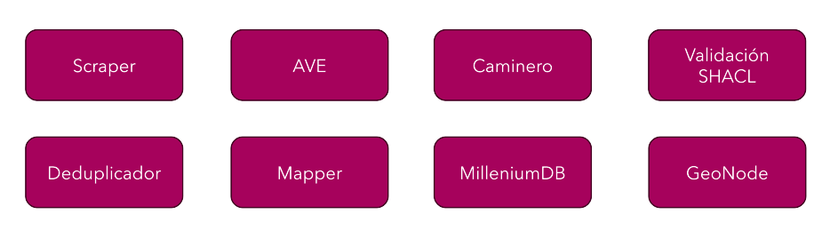
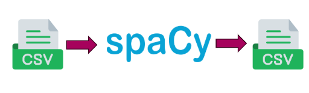
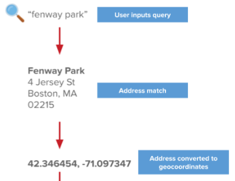
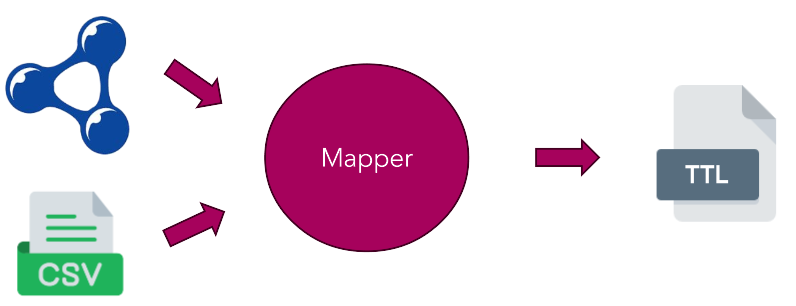
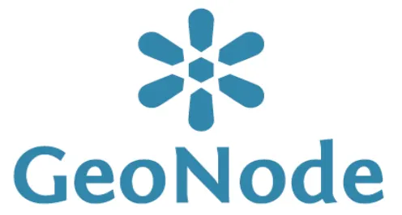

# Observatorio Inmobiliario
## Proyecto de vinculación tecnológica desde el Centro LIFIA en conjunto con el Centro LINTA dependiente de CICPBA
### 🌱 Módulos
**El proyecto se encuentra estructurado en 8 módulos:** 

---

#### 1) Módulo Scraper

El scraper es un script que permite obtener avisos inmobiliarios publicados en la web

- **Entrada:** --
- **Salida:** un archivo CSV
- **Repositorio:** es privado al momento. LINTA lo ejecuta y nos provee los csv
---

#### 2) Módulo AVE

El Attribute Value Extraction es el programa que extrae pares atributo-valor de características a partir de descripciones de avisos inmobiliarios usando NLP. Tesina licenciada Tanevitch + Proyecto IDI 2024

- **Entrada:** un archivo CSV con las descripciones de los inmuebles
- **Salida:** un archivo CSV con las características detectadas
- **Repositorio:** [OVS extractor Idis](https://github.com/cientopolis/OVS-extractor-idis)
---

#### 3) Módulo Caminero

El caminero consiste en un script que genera coordenadas a partir de una dirección en texto (geocodificación).

- **Entrada:** un archivo CSV con las direcciones de los inmuebles
- **Salida:** un archivo CSV con las coordenadas  detectadas
- **Repositorio:** [OVS caminero](https://github.com/cientopolis/OVS-caminero)
---

#### 4) Módulo Deduplicador
El deduplicador es un script que permite hallar inmuebles duplicados, hay dos versiones:
- **sobre CSV** => Recibe un CSV y devuelve un CSV con los duplicados de una uri. Approach bayesiano que compara ciertos campos del csv.
- **sobre TTL** => Enfoque inductivo y deductivo de deduplicación del grafo mediante embedding.
**Extra:** Hay una versión remasterizada en python para ejecutar en Eva. El siguiente documento explica más a detalle el trabajo realizado: [Graph Embeddings](https://docs.google.com/document/d/1GZFBkfj_5YY7em8HMkpv-gNVc4npLvi-oe9HaeFpG6M/edit?tab=t.0#heading=h.4jc0o2quxc0q)
---

#### 5) Módulo Mapper

El mapper esta formado por un script que permite convertir un archivo CSV en un grafo de conocimiento, en este caso en formato TTL. Para esto, utiliza una ontología que define conceptos inmobiliarios

- **Entrada:** un archivo CSV con todos los campos a estructurar
- **Salida:** un grafo de conocimiento en formato TTL
- **Repositorio:** [observatorio Inmobiliario](https://github.com/tanevitch/observatorioInmobiliario-pronto)
---
#### 6) Módulo MillenniumDB
MillenniumDB es un gestor de grafos de conocimiento optimizado para manejar grafos masivos.

- **Repositorio:** [Millennium DB](https://github.com/MillenniumDB/MillenniumDB)
---
#### 7) Módulo GeoNode

GeoNode es un software GIS. En 2024, se desplegó una instancia de GeoNode en el servidor LIFIA con la capacidad de albergar un archivo de datos en formato .csv

---
#### 8) Módulo QA
Question-Answering es una técnica que permite realizar consultas en lenguaje natural sobre una base de datos. Siendo SPARQL el lenguaje de consulta predeterminado para los grafos de conocimiento, se desea aplicar técnicas para poder realizar consultas en lenguaje natural sobre el grafo abstrayéndose del lenguaje de consulta subyacente.

---
### 🌱 Espacio para alumn@s

- [referencias para alumnos](https://github.com/cientopolis/observatorioInmobiliario/blob/main/REFERENCIAS.md)

### Equipos de trabajo 
[Ir a equipos](/equipos/readme.md) 

